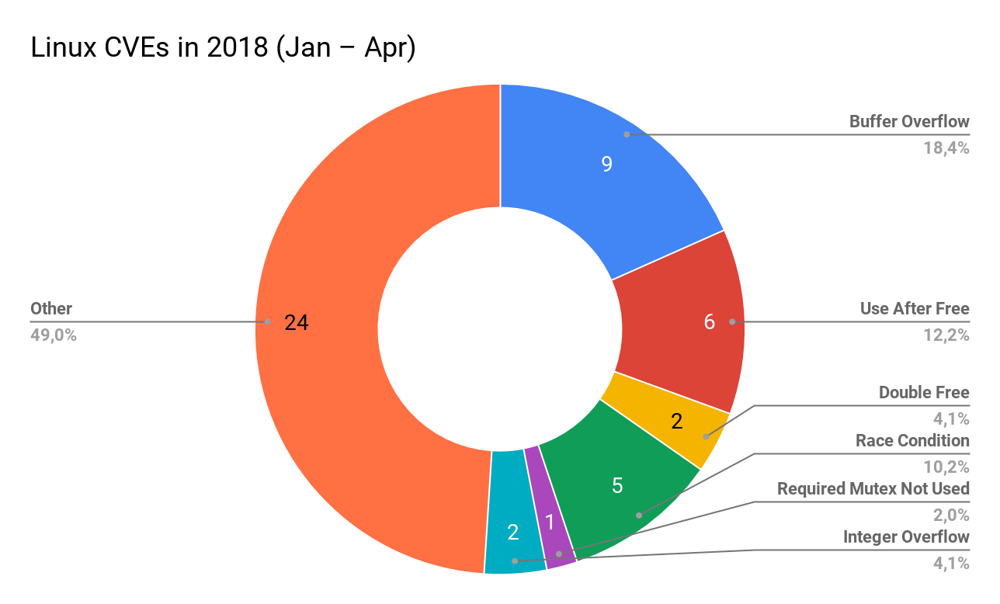
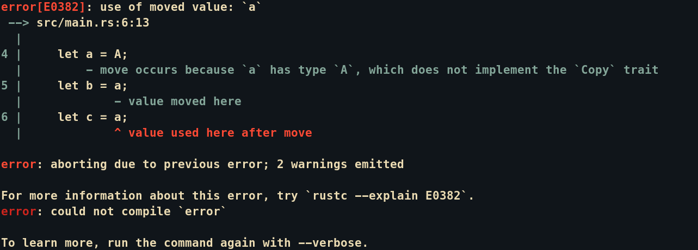

---
# History of Rust
  - Rust was a personal project that began in 2006 by Mozilla employee Graydon Hoare.
  - Hoare did not like how C++ handled concurrent code
  - Rust was intended to be a language for safe systems.
  - Mozilla began to sponsor the project in 2009.
  - The first prealpha release of Rust occurred in January 2012.
  - Rust 1.0 was released on May 15, 2015.
  - Rust Foundation was created in 2021 by Amazon, Microsoft, Google, Huawei, and Mozilla


---

# What is Rust?
  - Systems language
  - Statically-type multi paradigm language (functional, Structured, imperative etc.)
  - Focus on Performance, Reliability, and Productivity
  - Stack Overflow's most loved language for five years


---
# Terms to know

| Word                    | Definition                                                                      |
|-------------------------|---------------------------------------------------------------------------------|
| Pointer                 | Variable that stores the address of another variable                            |
| Free                    | Function that clears memory allocated to a variable                             |
| Garbage Collector       | A feature in languages that automatically frees memory not needed in runtime    |
| &                       | In C, a operation to view a memory address of a variable. In Rust, a reference |
| UB (Undefined Behavior) | When a program runs unexpectedly                                                |


---

# Basic Building Blocks

| Type  | Meaning                                             |
|-------|-----------------------------------------------------|
| i32   | Signed integer with 32 bits                         |
| u32   | Unsigned integer with 32 bits                       |
| f32   | Double with 32 bits                                 |
| usize | Uses your computer architecture's to determine size |
| char  | UTF-8 - 4 **bytes**                                 |
| &str  | Slice (String Literal)                              |

```rust
// Variables - Rust guesses the type of your variable most of the time
let s = "Löwe 老虎 Léopard 😳😩";

// But you can also tell rust the exact type you expect.
let x: i32 = 10;

// Rust also has tuples
let pair: (usize, f64) = (176, 87.123);

// Arrays that a known size at compile times
let arr: [i32;5] = [1, 2, 3, 4, 5];

// Rust has ArrayList but they are known as vectors
let vec: Vec = vec![1, 2, 3];
```

---
# More Goodies

```rust
// Functions
fn fibonacci(n: u32) -> u32 {
    // switch case -> expression matching
    match n {
        0 => 1,
        1 => 1,
        _ => fibonacci(n - 1) + fibonacci(n - 2),
    }
}

fn main() {
    // fizzbuzz
    let bank: [&str; 3] = ["FizzBuzz", "Buzz", "Fizz"];
    for i in 1..101 {
        let result = if i % 15 == 0 {
            bank[0].to_string()
        } else if i % 5 == 0 {
            bank[1].to_string()
        } else if i % 3 == 0 {
            bank[2].to_string()
        } else {
            i.to_string()
        };
        println!("{}", result);
    }
}
```

---

# Slighty more complex
```rust
// Rust is not an OOP Language, but..
struct Car {
 // variable_name: type
 registration_number: String,
 number_of_passengers: u8,
 price: f32,
 fuel_type: FuelType,
}

// Enums - Only one choice out of custom types below
// Prevent data entry errors
enum FuelType {
 Petrol,
 Diesel,
 Hybrid,
 Electric(String),
}

// Adding functions to struct
// let honda: Car = Car::new(parameters);
impl Car {
  fn new(
      registration_number: String,
      number_of_passengers: u8,
      price: f32,
      fuel_type: FuelType,
  ) -> Self {
      Self {
          registration_number,
          number_of_passengers,
          price,
          fuel_type,
      }
  }
}

// Think Java's interfaces or c declarations in headers (more simliar to the former)
// polymorphism!
trait EnvReg {
 fn fuel_efficiency_check(&self, fuel_consumption: f32) -> bool;
 fn co2_emission_check(&self, co2_emission: u8) -> bool;
}

impl EnvReg for Car {
 // Implement these functions for Car
 fn fuel_efficiency_check(&self, fuel_consumption: f32) -> bool {
    // ...
 }
 fn co2_emission_check(&self, co2_emission: u8) -> bool {
    // ...
 }
}
```

---

# Introduction to Rust - points to emphasize
  - Writing good code is hard
  - Writing safe code is harder
  - Working with memory is dangerous


---

# Purposely Badly Written Example in C
```c

#include <assert.h>
#include <stdio.h>
#include <stdlib.h>

// this example has a bunch of errors

// C Implementation for a vector (a dynamic array)
typedef struct {
  int *data;    // Pointer to our array on the heap
  int length;   // How many elements are in our array
  int capacity; // How many elements our array can hold
} Vec;

// this "constructor" is stack-allocated
// the pointer will be invalid after the function reaches its end of its scope
Vec *vec_new() {
  Vec vec;
  vec.data = NULL;
  vec.length = 0;
  // capacity is zero, but later we multiply by two. will always return zero
  vec.capacity = 0;
  return &vec;
}

void vec_free(Vec *vec) {
  // Incorrect order of freeing memory
  free(vec);
  free(vec->data);
}

void vec_push(Vec *vec, int n) {
  if (vec->length == vec->capacity) {
    int new_capacity = vec->capacity * 2;
    int *new_data = (int *)malloc(new_capacity);
    assert(new_data != NULL);

    for (int i = 0; i < vec->length; ++i) {
      new_data[i] = vec->data[i];
    }

    vec->data = new_data;
    // we never free the old data
    vec->capacity = new_capacity;
  }

  vec->data[vec->length] = n;
  ++vec->length;
}

void main() {
  Vec *vec = vec_new();
  vec_push(vec, 107);

  // iterator invalidation
  int *n = &vec->data[0];
  vec_push(vec, 110);
  printf("%d\n", *n);

  // double free
  free(vec->data);
  vec_free(vec);
}
```

---

# Essential Features
  - A language that can check for errors before runtime
  - As part of its design, immutatable by default
  - Forces you to handle errors
  - Ownership and borrow-checker
  - Lifetimes: constraints which scopes they may be moved out of



---

# Ownership, Borrow Checker, and lifetimes
## Ownership

> Each value in Rust has a variable that’s called its owner.
>
> There can only be one owner at a time, but multiple references
>
> When the owner goes out of scope, the value will be dropped.

## Borrow checker

> That all variables are initialized before they are used.
>
> That you can't move the same value twice.
>
> That you can't move a value while it is borrowed.
>
> That you can't access a place while it is mutably borrowed (except through the reference).
>
> That you can't mutate a place while it is immutably borrowed.
>
> etc


```rust
struct A;

fn main() {
    let a = A;
    let b = a;
    let c = a;
}
```



---

# Error Handling
  - Through `result`, `?`, `unwrap`and `Option<T>`
 

```rust
use std::{
    fs::File,
    io::{self, BufWriter, Write},
};

const WIDTH: usize = 800;
const HEIGHT: usize = 800;
const RANGE: usize = 255;

fn write_blocks(mut writer: impl Write) -> io::Result<()> {
    writeln!(writer, "P3 {} {} {}\n", HEIGHT, WIDTH, RANGE)?;
    let mut rng = rand::thread_rng();
    let mut blockrow = String::new();
    for _row in 0..8 {
        blockrow.clear();
        for _col in 0..8 {
            let rgb = Pixel {
                red: rng.gen_range(100, 250),
                green: rng.gen_range(0, 200),
                blue: rng.gen_range(50, 200),
            };
            for _blockrow in 0..100 {
                blockrow += &format!("{} {} {} ", rgb.red, rgb.green, rgb.blue);
            }
        }
        for _blockscol in 0..100 {
            writeln!(writer, "{}", blockrow)?;
        }
    }
    Ok(())
}

pub fn main() -> io::Result<()> {
    let mut file = File::create("block.ppm").unwrap();
    let writer = BufWriter::new(&mut file);
    write_blocks(writer)
}
```
---

# Zero-Cost Abstractions
  - Why not have cool features
  - No overhead
  - Compiler optimizations
  - Three different versions
  - https://godbolt.org/z/_h-meM


```rust
// Simple implmentation that is generic enough
pub fn sum(n: i32) -> i32 {
    let mut sum = 0;
    for i in 1..n {
      sum += i;
    }
    sum
}

// Implementation with rust closures (lambda functions)
pub fn sum2(n: i32) -> i32 {
   (1..n).fold(0, |x,y| x + y)
}

// The 'calling another function' way
pub fn sum3(n: i32) -> i32 {
  (1..n).sum()
}

```

```asm
example::sum2:
        xor     eax, eax
        cmp     edi, 2
        jl      .LBB0_2
        lea     eax, [rdi - 2]
        lea     ecx, [rdi - 3]
        imul    rcx, rax
        shr     rcx
        lea     eax, [rcx + 2*rdi]
        add     eax, -3
.LBB0_2:
        ret
```
---

# Macros!
  - Metaprogramming
  - Writes other code
  - No runtime cost
  - Two types: Declarative macros and Procedural Macros


## Declarative

```rust
macro_rules! add_as {
    // using a ty token type for matching data types passed to macro
    ($a:expr,$b:expr,$typ:ty) => {
        // will expand to the below
        $a as $typ + $b as $typ
    };
}

fn main() {
    println!("{}", add_as!(0, 2, u8));
}
```

```rust
macro_rules! vec {
    ( $( $x:expr ),* ) => {
        {
            let mut temp_vec = Vec::new();
            $(
                temp_vec.push($x);
            )*
            temp_vec
        }
    };
}

fn main() {
    let x: Vec = vec![10, 5, 1];
}
```
  
## Procedural
```rust
// An attribute that calls a derive macro
// There are some attributes that allow you to manipulate the item
#[derive(Getters)]
struct NewsFeed {
    name: String,
    url: String,
    category: Option<String>,
}

// Calling this macro will generate the following automatically
impl NewsFeed {
    pub fn name(&self) -> &String {
        &self.name
    }

    pub fn url(&self) -> &String {
        &self.url
    }

    pub fn category(&self) -> &Option<String> {
        &self.category
    }
}


// There are also function-life macros
use macro_derive::make_function;

fn main() {
    make_function!(fn double(usize) -> usize);
    double(1); // 2
    double(2); // 4
    double(3); // 6
}

```

---

# Compiler Messages Are Amazing
```rust
struct Color {
    r: u8,
    g: u8,
    b: u8,
}
fn main() {
    let yellow = Color {
        r: 255,
        g: 255,
        d: 0,
    };
    println!("Yellow = rgb({},{},{})", yellow.r, yellow.g, yellow.b);
}
```


---

# Toolchain
  - CARGO!
    - Build System
    - Install/Upload Crates
    - Unit Tests
    - Benchmark
    - Generate Documentation
    - Clippy - linter
  - Rustup
  - Rustfmt
  - Rust-analyzer
  - Everyone runs the same tools unlike other languages


---

# Even More Features
  - Great Libraries
    - Serde: serializing and deserializing data.
    - Rayon: writing parallel & data race-free code
    - Tokio/async-std: writing non-blocking, low-latency network services
    - Tracing: for instrumenting Rust programs to collect structured, event-based diagnostic information.
    - wasm-pack: integration with wasm
    - Juniper: integration with graphql
    - regex: One of the best Regex Libraries in any programming language

```rust
// Advent of code day 2-1
static INPUT: &str = include_str!("../input");
use regex::Regex;

fn first() {
    let lines: Vec<String> = INPUT.lines().map(|x| x.parse().unwrap()).collect();
    let mut valid = 0;
    // Make a regex
    let re = Regex::new(r"^(\d+)-(\d+) (\S): (\S+)").unwrap();
    for policy in lines {
        // regex from capture groups
        for group in re.captures_iter(&policy) {
            let count = &group[4]
                .chars()
                .filter(|x| x == &group[3].parse::<char>().unwrap())
                .count();
            if &group[1].parse::<usize>().unwrap() <= count
                && count <= &group[2].parse::<usize>().unwrap()
            {
                valid += 1;
            }
        }
    }
    println!("Part 1: {}", valid)
}
```

---

# What you can use Rust for:
  - Writing system software
  - Web projects (ie. Dropbox, OpenDNS, Coursera, Discord)
  - Games (lack of garbage collector)
  - Networking due to security and reliability
  - Machine learning (low-level memory control and performance)


---

# Why you shouldn't use Rust
  - Compiler is very slow due to many features
  - APIs are changing in libraries frequently due to how new they are
  - Language is difficult for people coming from other languages
  - Code is a lot harder to develop than on c or c++ (higher learning curve)


---

# Other

## Resources
  - This repo: https://github.com/KarlWithK/rust-presentation
  - https://tourofrust.com/00_en.html
  - https://reberhardt.com/cs110l/spring-2020/
  - https://wiki.mozilla.org/Areweyet

## Companies Hiring:
  - Apple
  - Microsoft
  - Google
  - Mozilla
  - Huawei
  - Amazon
  - Soon anywhere where networking is a concern

## How this was made (Sources)
  - https://github.com/d0c-s4vage/lookatme
  - https://hackernoon.com/programming-in-rust-the-good-the-bad-the-ugly-d06f8d8b7738
  - https://aws.amazon.com/blogs/opensource/aws-sponsorship-of-the-rust-project/
  - Karl.SeniorMars (Trust me bro)
  - https://thefuntastic.com/blog/why-rust-is-the-future-game-dev
  - https://idursun.com/posts/rust_zero_cost_abstractions_in_action/
